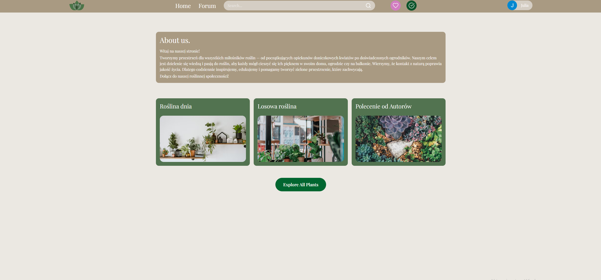
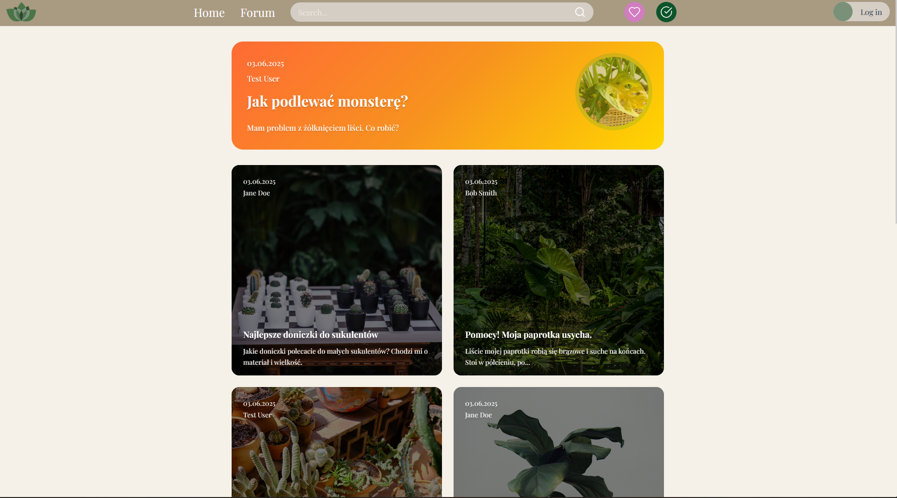
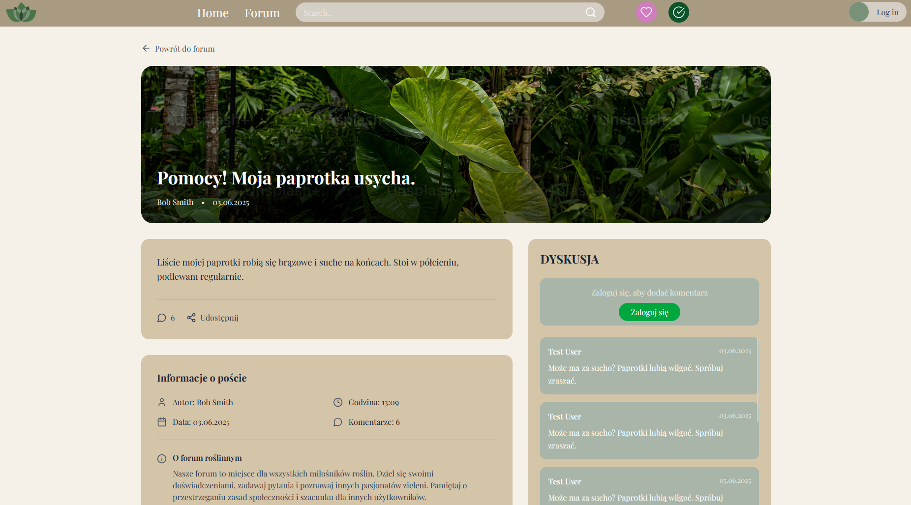

# 🌿 Botanicials

**Botanicials** to aplikacja webowa dla miłośników roślin. Umożliwia tworzenie i komentowanie postów na forum, zarządzanie osobistą
kolekcją roślin oraz listą życzeń. Aplikacja składa się z nowoczesnego frontendu React i bezpiecznego backendu w Spring Boot.

---

## 🧩 Zawartość projektu

```
Botanicials/
├── backend/      # Spring Boot (Java)
├── frontend/     # React + Vite (TypeScript)
└── README.md     # Niniejszy plik
```

---

## 📦 Technologie

### Backend
- **Java 17**
- **Spring Boot**
- **JWT & OAuth2**
- **Docker & Docker Compose**
- **Maven**

### Frontend

- **React 19**
- **Vite**
- **TypeScript**
- **Tailwind CSS**
- **React Query**
- **React Router v7**

---

## 🚀 Jak uruchomić

### 🛠 Wymagania wstępne

- Java 17+
- Docker i Docker Compose
- Node.js `>=18`, npm `>=9`

---

# 🧪 Backend (Spring Boot)


##  Przejdź do katalogu backend
```bash
cd backend
```
## dodaj plik .env
```
GOOGLE_CLIENT_ID=
GOOGLE_CLIENT_SECRET=
PERENUAL_API=
```

## Uruchom z Docker Compose
```
docker-compose up --build
```

Domyślnie backend dostępny będzie pod:
```
http://localhost:8080
```

---

# 💻 Frontend (React + Vite)


## Przejdź do katalogu frontend
```bash
cd front
```
## Uruchom z Docker Compose
```
docker-compose up --build
```

Domyślnie frontend dostępny będzie pod:
```
http://localhost:5173
```

---

## 🔐 Autoryzacja i bezpieczeństwo

- 🔑 Logowanie z wykorzystaniem JWT
- 🌐 Obsługa OAuth2 (np. Google)
- 🔒 Rate limiting oraz filtry bezpieczeństwa

---

## 🧰 Główne funkcje

- 🌱 Kolekcja – zarządzanie własnymi roślinami
- 🌿 Wishlist – lista roślin do zdobycia
- 👥 Rejestracja / logowanie
- ⚙️ REST API z bezpieczną konfiguracją
- 🗨️ Forum – tworzenie postów i komentarzy

---

🔗 Repozytorium: [Botanicials na GitHubie](https://github.com/aishex/Botanicials)

---

### Contributors


[](https://github.com/duck4912)  
[duck4912](https://github.com/duck4912)

[](https://github.com/aishex)  
[aishex](https://github.com/aishex)

[](https://github.com/ReQs1)  
[ReQs1](https://github.com/ReQs1)

---

## 💻 Preview

Poniżej kilka zrzutów ekranu z aplikacji Botanicials:








